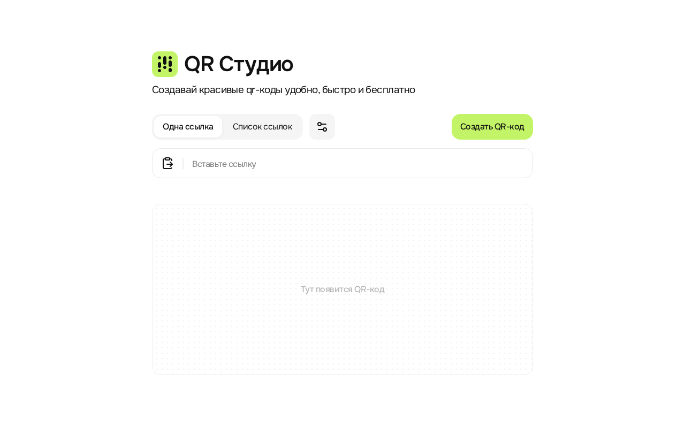

# QR Студио

[](https://github.com/SpellbourneDZ/rounded-qr-studio/actions/workflows/test.yml)

**Создавайте QR-коды для ссылок прямо в браузере.** Выберите стиль и цвет, скачайте прозрачный PNG или SVG. Для списка ссылок генератор соберёт файлы в ZIP-архив.

[Открыть QR Студио](https://studio-qr.ru) · [Сообщить об ошибке или предложить идею](https://github.com/SpellbourneDZ/rounded-qr-studio/issues)



## Возможности

- Одна ссылка или список до 100 ссылок, по одной на строку.
- Три стиля: скруглённый, классический и круглый.
- Тёмный, белый или свой цвет QR-кода. При выборе белого цвета предпросмотр остаётся тёмным, а скачанный файл будет белым.
- Прозрачные PNG и SVG размером 1024 × 1024 пикселя.
- Отдельная загрузка SVG из списка или скачивание всего списка в ZIP в формате PNG либо SVG.
- Генерация и экспорт выполняются в браузере: введённые ссылки приложение не отправляет на сервер.

## Как пользоваться

1. [Откройте генератор](https://studio-qr.ru) и вставьте ссылку с `https://` или `http://`.
2. Для нескольких ссылок выберите «Список ссылок» и разместите каждую ссылку на новой строке.
3. При необходимости откройте «Настройки», выберите стиль и цвет, затем нажмите «Создать QR-код».
4. Скачайте PNG или SVG. Для нескольких кодов кнопки «Скачать все» создают ZIP-архив.

Генератор принимает до 100 ссылок за раз. Длина каждой ссылки — не более 2000 байт в UTF-8. Экспортируемые файлы не содержат защитного светлого поля вокруг кода. При размещении на макете оставьте вокруг QR-кода свободное светлое поле шириной не менее четырёх модулей; белый QR-код размещайте на тёмном фоне. Перед печатью проверьте сканирование итогового макета.

## Запуск локально

Сайт находится в `dist/` и не требует сборки. Нужен только локальный HTTP-сервер:

```bash
git clone https://github.com/SpellbourneDZ/rounded-qr-studio.git
cd rounded-qr-studio
python -m http.server 4173 --bind 127.0.0.1 --directory dist
```

Откройте <http://127.0.0.1:4173/>. Команда `npm start` запускает тот же сервер и также требует установленного Python.

Для проверки экспорта нужен Node.js и npm:

```bash
npm ci
npm test
```

Проверка декодирует экспортированный SVG независимым декодером и проверяет прозрачность, UTF-8, ссылки и ZIP-архив.

## Участие в проекте

Нашли ошибку или хотите предложить улучшение? [Создайте issue](https://github.com/SpellbourneDZ/rounded-qr-studio/issues). Для изменений в коде есть [инструкция для участников](CONTRIBUTING.md).

Исходный код проекта распространяется по [лицензии MIT](LICENSE). Лицензии включённых библиотек, шрифта и иконок находятся в `dist/vendor/`, `dist/assets/` и [THIRD_PARTY_NOTICES.txt](dist/THIRD_PARTY_NOTICES.txt).

---

**English:** QR Studio is a free browser-based QR code generator with three styles, custom colors, transparent 1024 × 1024 PNG/SVG exports, and batch ZIP downloads for up to 100 links. Your links are processed in the browser. The interface is currently in Russian. [Try the live app](https://studio-qr.ru) or [run it locally](#запуск-локально).
